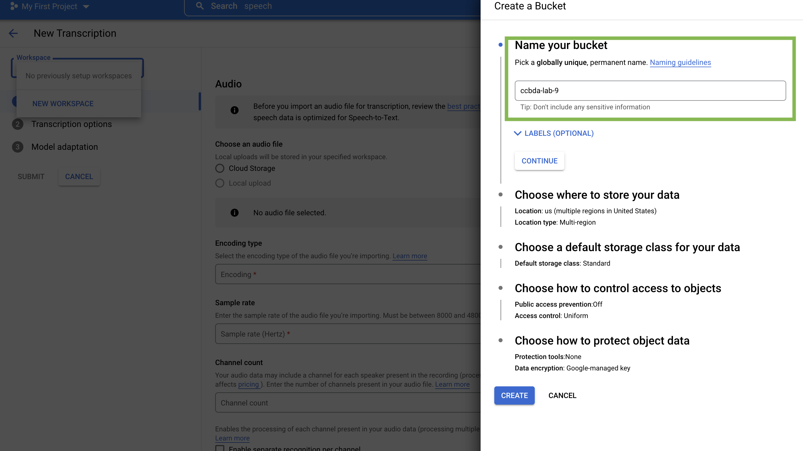

# Lab session #9: Using Speech to Text API for task automation
<!--
what is speech to text
technology we wanna use/teach

TASK 1


explain what is the google service about speech to text
sign up
api keys


let the user try the service through the browser (if it’s possible)

TASK 2
the user have to send a file to the API
let the user use the streaming version


TASK 3
we provide to the user some audio-track and the user has to sent all of them to Google and collect the results(text) and then make analysis about them (most common word)

TASK 4
streaming (microphone) and create a script that through os python library do something in the terminal (like creating a file)

{
“create directory <name>” : mkdir <name>
“create file <name>” : touch <name>
“print <something>” : echo <something>
}

Qxy: what are the voice messages talking about?
 -->

In this Lab session we would perform several experiments with the Google [Speech to Text API](https://cloud.google.com/speech-to-text). First we would transcribe an audio file to text. Then we would leverage that feature and try to come out with insights on the topic of the audio. Lastly, we would use the API to automate running commands from the terminal in a voice command fashion.


The Speech-to-Text service could be used to leverage several use cases:

- Transcribe content with accurate captions - could be used to compute subtitltes on recorded or live online meetings. Such example features could be seen on Zoom recording or live on Microsoft Teams.

- Enable the power of voice to create better user experiences -  Voice commands for personal robots or used for software capabilities helping people with different disability needs.

Speech-to-Text can use one of several machine learning models to transcribe your audio file. Google has trained these speech recognition models for specific audio types and sources. Moreover, there are more [languages generally supported](https://cloud.google.com/speech-to-text/docs/languages) by the API. In this Lab we would be using only English US examples, as it has been supported by the most models.

## Task 1
You could continue working in the same project that you have created from [the previous lab](https://github.com/CCBDA-UPC/Assignments-2022/blob/origin/Lab08.md). Otherwise -  [create a new project](https://cloud.google.com/resource-manager/docs/creating-managing-projects). Remember to setup Billing for the project.

When you are logged in the Google Platform, search for [Speech to Text API](https://console.cloud.google.com/speech) and enable the API.


Then you touch `Create Transcription`  button to run the service. You will see the following:


You need to create a new workspace. Touch `Create workspace` and a side menu will show you the following


Go to `Browse` and create a new bucket like this:


Give it a name and then click `Create`



Now Select the workspace that you just created and you would be able to upload a local audio file or select a file from the bucket you just created.

We can use the Open data Voice speech in America English - https://www.voiptroubleshooter.com/open_speech/american.html.

Take one of the files from there and download it on your machine. Then select `Local Upload` and select the audio file that you just downloaded.

In the `Transcription Options` tab, select `en-US` as the Spoken Language. Keep the Transcription Model as Default, click Continue and Submit the transcription.

Then in the side menu there is the `Transcription` tab. Go there and you will find the transcription of the file you just uploaded. When you click on it you will see somehting like this:


Now you can go to the bucket you created in Cloud Storage and you will see the following folders:
 - audio_files
 - transcripts

## Task 2

You would need to use Service Account Keys.
How to get the google service account credentials:
1. Access the Service Accounts page
2. Create a new Service account and click on it
3. Go to the Key tab
4. Click on Add Key and select Create new key
5. Select JSON
6. Save your JSON file on your local machine

Now we can start using the API locally.

To authenticate locally, set the `GOOGLE_APPLICATION_CREDENTIALS` environment variable to point to your downloaded service account credentials before running this example:

```
export GOOGLE_APPLICATION_CREDENTIALS=/path/to/your/credentials-key.json
```

Install the Speech-to-Text API by running:
```
pip install --upgrade google-cloud-speech
```

Go to your bucket in Google Platform and find the audio file that you uploaded in the `audio_files` folder. Click on the file and go to the `Edit access` tab. Set the access to public.  If you have issues setting this access, go to Bucket configurations and set the Access Control to Fine-grained.


Then you should be able to set the public access of the file. Copy the gsutil URI of the file and put it in the corresponding place in the following code.

Then run the example:

```
from google.cloud import speech

# Instantiates a client
client = speech.SpeechClient()

# The name of the audio file to transcribe
gcs_uri = "gsutil URI HERE"

audio = speech.RecognitionAudio(uri=gcs_uri)

config = speech.RecognitionConfig(
    encoding=speech.RecognitionConfig.AudioEncoding.LINEAR16,
    sample_rate_hertz=8000,
    language_code="en-US",
)

# Detects speech in the audio file
response = client.recognize(config=config, audio=audio)

for result in response.results:
    print("Transcript: {}".format(result.alternatives[0].transcript))

```
This will print the transcript of the audio file that you have previously uploaded.

Now you know how to use run Speech-to-Text API from the console and locally.

## Task 3

In this task you are going to use the Google Cloud API in order to write
a script that, given an audio file, send it to the Speech-to-Text service
to analyse it.

You're going to analyse a speech of a famous person.
You can find the speech inside the repository under the name of
`speech.mp3`. You can use the `long_speech_to_text.py` script to send the
audio to Google.

Check at the results if they hold with the audio.

### Task 3.2: Result Analysis

Now that you have the transcipt of the speech, you can create another
script named `analysis.py` and you can look what is the most common
words of the speech. Analyse the results and create a PNG file containing
an histogram of what Google thinks about the speech.

### Task 3.3: Student proposal

Let's find some other audio files to analyse. You can retrieve them from
any sources that you want. The only constraint is that you have to use
mp3 format and the audio has to be longer than a minute.

You can upload that files in the bucket that you have created before and change
the script that you have just used in order to analyse them.

Do some screenshot at the results and check if they hold with the audio
you provided. Add them to the README file.

## Task 4

In this task we are going to try to understand audio from microphone and execute corresponding CLI commands.

First of all we need to install a library using brew that would help us accessing the I/O from the microphone:

```
brew install portaudio
```

After that, we need to install the python library pyaudio.
```
pip install pyaudio
```
 **If you cannot install `pyaudio` because of an issue with `portaudio.h` then you have to run the following command (Under assumption that the headers are in `/usr/local/include`):**
```
pip install --global-option='build_ext' --global-option='-I/usr/local/include' --global-option='-L/usr/local/lib' pyaudio
```

Once we have it, we can execute the code:

```
python cli.py
```
And we should see how it starts listening to our microphone:


As we can see, in the terminal it appears what we are saying.

### Task 4.1
Now we want to exploit this to tell to the computer what do we want to do.
For example we would like both:
- When we say "create folder": It should create a new folder
- When we say "show files": It should list all files that exist in the current folder.

Function listen_print_loop in [cli.py](cli.py) listens for the responses the server returns and then it shows them on the terminal.

```
def listen_print_loop(responses):
    num_chars_printed = 0
        for response in responses:
            if not response.results:
                continue

            # The `results` list is consecutive. For streaming, we only care about
            # the first result being considered, since once it's `is_final`, it
            # moves on to considering the next utterance.
            result = response.results[0]
            if not result.alternatives:
                continue

            # Display the transcription of the top alternative.
            transcript = result.alternatives[0].transcript

            # Display interim results, but with a carriage return at the end of the
            # line, so subsequent lines will overwrite them.
            #
            # If the previous result was longer than this one, we need to print
            # some extra spaces to overwrite the previous result
            overwrite_chars = " " * (num_chars_printed - len(transcript))

            if not result.is_final:
                sys.stdout.write(transcript + overwrite_chars + "\r")
                sys.stdout.flush()

                num_chars_printed = len(transcript)

            else:

                # Exit recogqnition if any of the transcribed phrases could be
                # one of our keywords.
                if re.search(r"\b(exit|quit)\b", transcript, re.I):
                    print("Exiting..")
                    break

                num_chars_printed = 0
```

Modify a litle bit this function behaviour in order to answer to add the user's desire of creating a new folder and showing files.

## How to deliver the assignment

Produce a README file with all the screeshots and comments in order to
let us understand what you have done. 